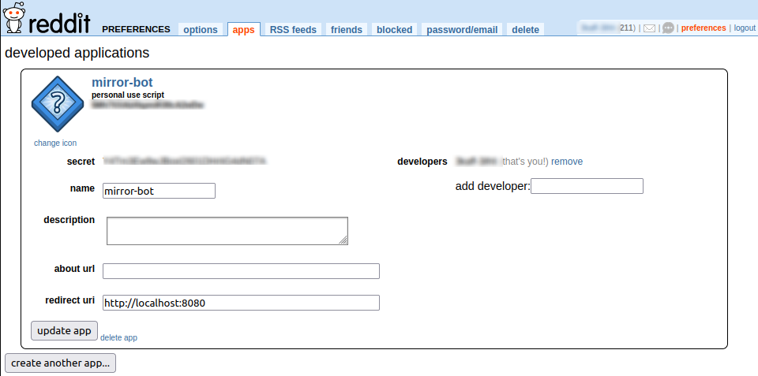
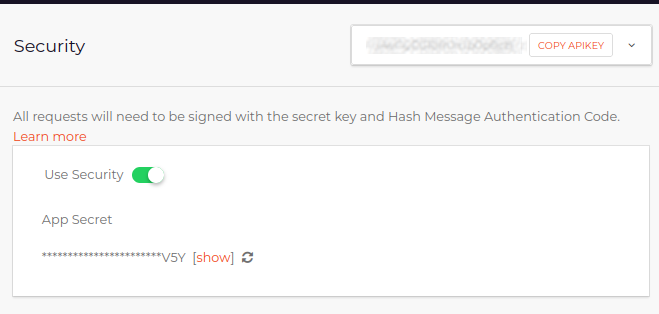
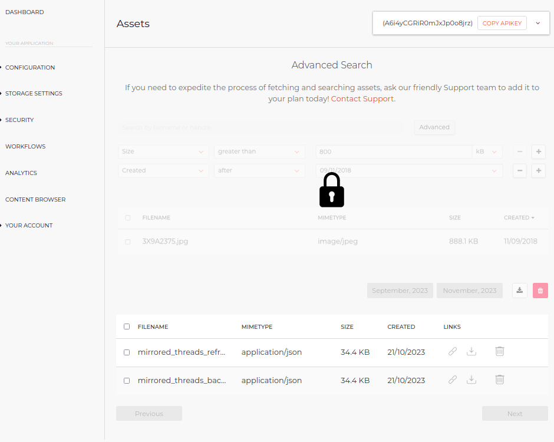

# Lemmy Utility Bot

### This is a lemmy utility bot (in the making).

#### Supported Tasks:


| TASK NAME                  | DESCRIPTION    | STATUS     |
| ------------------------   | ---------------| ---------- |
| `mod_comment_on_new_threads` | Add a [custom mod message](#configure-the-mod-message) to all new posts in a lemmy community | SUPPORTED :white_check_mark:
| `mirror_threads`             | Mirror threads from one reddit sub to one lemmy instance       | SUPPORTED :white_check_mark:
|   TBD                      |  Media Bias/Fact Check (or some other "less biased" source) comment on new URL threads              | IN PROGRESS :hammer:
|   TBD                      |  Send an auto-message to users reporting content | IN PROGRESS :hammer:

This project is a hobby project and open to requests. 

| :zap:      Deployed on   |
|-----------------------------------------|
| [!exmuslim@lemmy.world](https://lemmy.world/c/exmuslim) | 
| [!atheismindia@lemmy.world](https://lemmy.world/c/atheismindia) |

## Prerequisites
1. [Poetry](https://python-poetry.org/docs/#installation), version 1.6, With Python >=3.9,<3.12
2. [Docker](https://docs.docker.com/engine/install/), version >= 24.0
3. Basic knowledge of python, docker, and git


### Develop yourself
1. Clone the repo:

    ```shell
    git clone https://github.com/i-be-snek/lemmy-util-bot.git
    ```

2. Install the prerequisites. Confirm that the right versions are installed:

    ```shell
    poetry --version
    >> Poetry (version 1.6.1)
    ```

    ```shell
    docker --version
    >> Docker version 24.0.6, build ed223bc
    ```

    Note that the minor and patch versions may differ. 

3. Install dependencies via Poetry and activate the virtual environment

    ```shell
    # install deps
    poetry install --only=main,test

    # activate virtual env via poetry
    poetry shell
    ```
## Building your own instance of the bot

You can deploy your own instance of the bot, either locally on your own computer, or by deploying it to a cloud service. One easy option is [Digital Ocean](https://docs.digitalocean.com/products/)

Follow these steps to configure and run the bot:

### Configure the bot settings

This is the step where you can configure your bot. 

1. Create a new text file named ".env" in the root directory of the repo

    ```shell
    touch .env
    ```

2. Open the file in your favorite editor and paste the following inside:


    For the `mod_comment_on_new_threads` task: 

    ```shell
    LEMMY_USERNAME=
    LEMMY_PASSWORD=
    LEMMY_INSTANCE=
    LEMMY_COMMUNITY=
    LEMMY_MOD_MESSAGE_NEW_THREADS=
    ```
    
    For the `mirror_threads` task: 

    ```shell
    REDDIT_CLIENT_ID= 
    REDDIT_CLIENT_SECRET= 
    REDDIT_PASSWORD=
    REDDIT_USER_AGENT= 
    REDDIT_USERNAME= 
    REDDIT_SUBREDDIT= 
    FILESTACK_API_KEY=
    FILESTACK_APP_SECRET=
    FILESTACK_HANDLE_REFRESH=
    FILESTACK_HANDLE_BACKUP=
    REDDIT_THREADS_TO_IGNORE=
    FILTER_BY=
    ```
    
    Finally, paste the `TASKS` variable into the file with a list of the tasks you want the bot to perform.
    For example, to mirror threads and also post a mod comment on new threads, add the names of both tasks separated by a comma. The names of available tasks [can be found here](#supported-tasks)

    ```shell
    TASKS=mod_comment_on_new_threads, mirror_threads
    ```
    

3. **Fill the Lemmy variables.** 

    The first four are easy.
    At this point, it's recommended to create a new lemmy account that is clearly marked as a bot. `LEMMY_USERNAME` should not include `u/`. The URL to the lemmy instance `LEMMY_INSTANCE` should include `https://`. The `LEMMY_COMMUNITY` is the target community where the bot will be able to write threads. Do not include `c/` in the community name. Example:
    ```shell
    LEMMY_USERNAME="AweSomeUser65"
    LEMMY_PASSWORD="somePassWord"
    LEMMY_INSTANCE="https://lemmy.world"
    LEMMY_COMMUNITY="world"
    ```

    The `LEMMY_MOD_MESSAGE_NEW_THREADS` is a custom message to post on each new thread in your lemmy community. If it spans over several new lines, replace the new lines with `\n\n`. Use the same markdown rules of the lemmy instance you want to deploy the bot on and it should (hopefully) format it correctly. 

    ```
    LEMMY_MOD_MESSAGE_NEW_THREADS=Please be civil!\n\nStick to the [rules](https://legal.lemmy.world/). For reports, contact u/my_community_mod
    ```

    This would render the mod message as follows:
    > Please be civil!
    > Stick to the [rules](https://legal.lemmy.world/). For reports, contact the mods.

> [!WARNING]  
> Steps 4-9 are only needed the `mirror_threads` task. 


4. **Fill the Reddit variables**  

    `REDDIT_USERNAME` and `REDDIT_PASSWORD` are self-explanatory (but do not add `u/` to the username). 
    
    To get the `REDDIT_CLIENT_ID` and `REDDIT_CLIENT_SECRET`, you need to visit [reddit.com/prefs/apps](https://www.reddit.com/prefs/apps/) amd create an app. You can leave `about url` empty, and type `http://localhost:8080` into the `redirect uri` field.
    
    Once successful, you'll be able to see a serial alphanumerical under the name of your app, right underneath _"personal use script"_. This is your `REDDIT_CLIENT_ID`. If you click "edit", you should be able to see the secret; this is your `REDDIT_CLIENT_SECRET`. Do not include `r/` in the `REDDIT_SUBREDDIT`. Finally, `REDDIT_USER_AGENT` is a free-text string to identify who you are and what task you are doing. It's best to include your main reddit username in this string. Example:

    

    ```shell
    REDDIT_USERNAME="MagnificentPotato"
    REDDIT_PASSWORD="somePassWord"
    REDDIT_CLIENT_ID="Fsh7AEAbXkpmiK0aseA93bjd7"
    REDDIT_CLIENT_SECRET="YfT586Ew9w8462SdvSSHh6G4dN07A"
    REDDIT_USER_AGENT="util bot u/MagnificentPotato"
    REDDIT_SUBREDDIT="all"
    ```

5. To be able to store and backup a small database with all the reddit threads the bot has already mirrored, [create a free Filestack account](https://dev.filestack.com/signup/free/). The database that keeps getting updated by the bot will be stored there so that the bot avoids cluttering lemmy with threads that have already been mirrored. It also ensures that the data is backed up somewhere.

    Click `COPY APIKEY` from the top right corner, this is the value for `FILESTACK_API_KEY`. To get `FILESTACK_APP_SECRET`, click on `SECURITY` > `Policy & Signature` on the left tab. Toggle on the `Use Security` option and click "show" to see your app secret.

    
    
    ```shell
    FILESTACK_API_KEY="A6i4yasdRR0mJadJp0o8jdWA"
    FILESTACK_APP_SECRET="2XTBUKJHHRFUN6KC62UV5MPY5Y"
    ```

6. The Filestack backups will always overwrite an already-existing file. This is because Filestack only allows 500 files to be uploaded for free, so overwriting them ensures being able to use it for free. `FILESTACK_HANDLE_REFRESH` will be the "handle" (or ID) of a copy of the database that the bot will overwrite frequently (such as every 5 minutes or every hour). `FILESTACK_HANDLE_BACKUP`, on the other hand, is a backup copy that the bot overwrites every few days, as an additional "just in case" backup. To automatically upload these files and get the handle, run this dedicated python script in the root directory:

    ```shell
    poetry run python3 get_filestack_handles.py
    ```

    The script will ask you to provide the Filestack API key and App secret.
    
    Once done, the output should be similar to this:

    ```shell
    2023-10-29 08:17:38 INFO     Uploading file mirrored_threads_refresh.json to https://cdn.filestackcontent.com/LIbC0wBfsAzs62QadcDrZ with handle LIbC0wBfsAzs62QadcDrZ.
    2023-10-29 08:17:40 INFO     Uploading file mirrored_threads_backup.json to https://cdn.filestackcontent.com/GAbC0wsdfDacYQadaS with handle GAbC0wsdfDacYQadaS.


    Add these variables to the .env file
    FILESTACK_HANDLE_REFRESH="LIbC0wBfsAzs62QadcDrZ"
    FILESTACK_HANDLE_BACKUP="GAbC0wsdfDacYQadaS"
    ```

    To confirm that the files have been uploaded, sign in to [dev.filestack](https://dev.filestack.com) and navigate to `Content Browser`. There you should be able to view the files just uploaded by the python script.

    


7. Finally, choose which threads to ignore

    | name     | Ignores    | 
    | -------- | ---------- |
    | mirrored | Ignores already mirrored threads added to the Filestack backup                 | 
    | pinned   | Ignores pinned (or "stickied") threads                                         | 
    | nsfw     | Ignores NSFW threads marked as "over_18" by Reddit                             | 
    | poll     | Ignore poll threads                                                            | 
    | locked   | Ignore threads locked by mods                                                  | 
    | video    | Ignore threads with an uploaded video (not threads linking to a video)         | 
    | url      | Ignore threads with URL links external to Reddit. *Does not ignore image links | 
    | flair    | Ignore threads which has a flair                                               | 
    | body     | Ignore threads with only a text (non-image, non-url, non-video) body                                                | 
    | image     | Ignore threads with an image url                                              | 
    | reddit_gallery | Ignore "reddit gallery" images. This is useful because Reddit galleries don't embed well as links on Lemmy instances and would link to reddit | 

    
    For example, to ignore NSFW, pinned, and already-mirrored threads from Reddit, type the names separated by a comma
    
    ```shell
    REDDIT_THREADS_TO_IGNORE="mirrored,pinned,nsfw"
    ```

    I recommend these settings to avoid mod posts, pinned posts, and reddit gallery posts that don't render so nicely on the lemmy ui:

    ```
    REDDIT_THREADS_TO_IGNORE="mirrored,pinned,nsfw,poll,locked,video,reddit_gallery"
    ```


8. You configure the scheduling times by adding these to the .env file (otherwise the script falls back to its defaults):

    ```shell
    # how long to wait in hours before making a backup of the filestack database, default = 36 (hours)
    BACKUP_FILESTACK_EVERY_HOUR=36

    # how long to wait in minutes before refreshing of the filestack database,
    # this should be done frequently default = 30 (minutes)
    REFRESH_FILESTACK_EVERY_MINUTE=30

    # the number of new threads to mirror, from the list of threads available to mirror
    # this is useful when complying with lemmy instance regulations that may only allow up to N threads mirrored per day/hour, etc. 
    REDDIT_CAP_NUMBER_OF_MIRRORED_THREADS=10

    ```
    
    #### Scheduling Option 1: If you want to mirror threads every X seconds, use these settings:

    ```
    # schedule the mirror script to run every X seconds (to comply with the Lemmy instance rules or 
    # avoid reposting every second, for example), default = 60 (seconds)
    MIRROR_THREADS_EVERY_SECOND=60

    # add a delay between each thread mirrored to Lemmy, default = 60 (seconds)
    DELAY_BETWEEN_MIRRORED_THREADS_SECOND=60

    # the number of new threads to consider for mirroring, default = 30 threads
    REDDIT_FILTER_THREAD_LIMIT=30

    ```

    #### Scheduling Option 2: If you want the bot to only post once a day, you can specify this in UCT time:

    ```
    MIRROR_EVERY_DAY_AT="12:30"
    ```


### (C) Build the docker image

Now that the `.env`` file is ready, we can build and run the docker image.

The variables filled in the `.env` file need to be available to the bot at runtime

```
set -a; source .env; set +a
```

```shell
# build the docker image and add a tag
docker build -t lemmy-util-bot:latest .
```

Once built, the bot can start working locally.

```shell
# run the docker image
docker run --env-file .env lemmy-util-bot:latest
```


If some of your variables are missing for the tasks you selected, the script will list these in the log. Example:

```shell
Skipping virtualenv creation, as specified in config file.
2023-11-24 17:14:05 ERROR    Main variable LEMMY_USERNAME is missing
2023-11-24 17:14:05 ERROR    Main variable LEMMY_PASSWORD is missing
2023-11-24 17:14:05 ERROR    Main variable LEMMY_INSTANCE is missing
2023-11-24 17:14:05 ERROR    Main variable LEMMY_COMMUNITY is missing
2023-11-24 17:14:05 ERROR    Main variable TASKS is missing
2023-11-24 17:14:05 ERROR    Main variable LEMMY_MOD_MESSAGE_NEW_THREADS is missing
Traceback (most recent call last):
  File "//main.py", line 84, in <module>
    config = Config(env_values)
  File "<string>", line 8, in __init__
  File "/src/helper.py", line 92, in __post_init__
    for x in Util._get_clean_list(self.config["TASKS"])
KeyError: 'TASKS'
```


## Deployimg the bot (to Digital Ocean)

(more on that soon)


